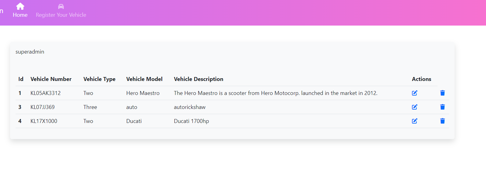

  <li>Install the required dependencies by running the following command:

<pre><code>$ pip install -r requirements.txt
</code></pre>

  </li>
  <li>Run the following commands to migrate the database and create a superuser:

<pre><code>$ python manage.py migrate
$ python manage.py createsuperuser
</code></pre>

  </li>
  <li>Start the development server by running the following command:

<pre><code>$ python manage.py runserver
</code></pre>

  </li>
  <li>Open a web browser and navigate to <code>http://127.0.0.1:8000/</code> to access the application.</li>
</ol>

<h2>Usage</h2>

After installing the application, you can start using it by logging in to the system using the superuser credentials created during installation. From the dashboard, you can add, edit, and view all the information related to your vehicles based on your role's permissions.

<h2>Access Management</h2>

The Vehicle Management System has a role-based access management system with threetypes of roles: Super admin, Admin, and User. Each role has different permissions as described below:

<ul>
  <li><strong>Super admin:</strong> Super admin has full access to all the functionalities, including the ability to perform CRUD operations.</li>
  <li><strong>Admin:</strong> Admin has the ability to edit and view vehicle information but cannot delete it.</li>
  <li><strong>User:</strong> User can only view vehicle information and cannot make any changes to it.</li>
</ul>
<h2>images<h2>

Images Views of Super Admin

<ul>
    <li> Registration
        
    <li>
    Login
    <li> 
        
    <li>
    To add vehicle details
    <li> 
        
    <li>
    To Update Vehicle details
    <li> 
        
    <li>
    Dashboard -Edit and Delete options
    <li> 
        
    <li>
</ul>

User dashbaord

