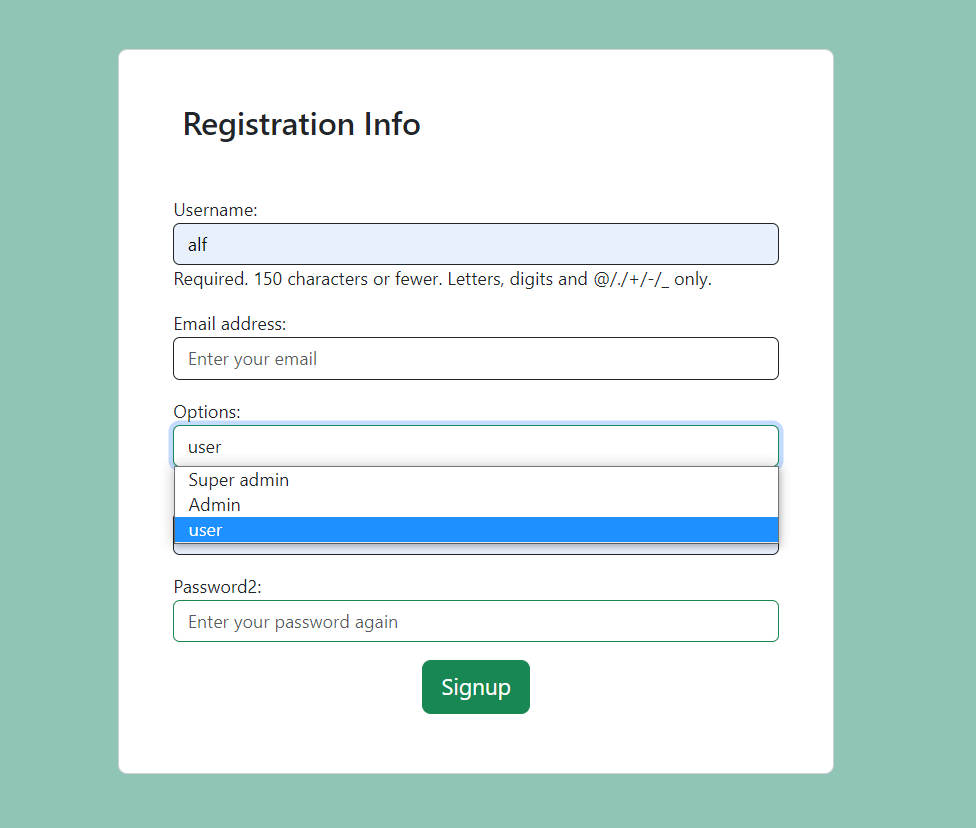
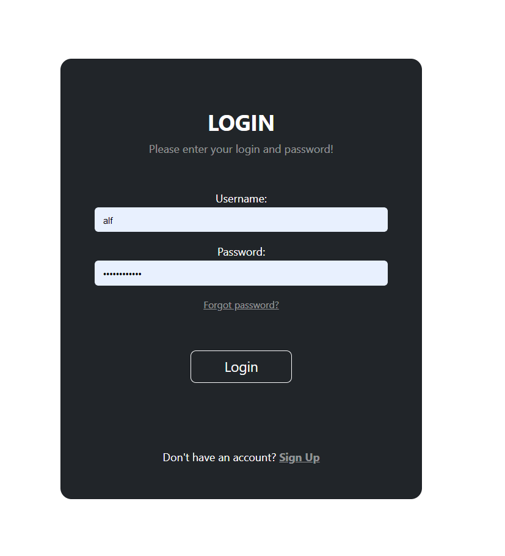

<h1>Vehicle Management System</h1>

A comprehensive and user-friendly application to manage and organize your vehicle information with role-based access management.

<h2>Table of Contents</h2>

<ul>
  <li><a href="#introduction">Introduction</a></li>
  <li><a href="#features">Features</a></li>
  <li><a href="#used-technologies">Used Technologies</a></li>
  <li><a href="#installation">Installation</a></li>
  <li><a href="#usage">Usage</a></li>
  <li><a href="#access-management">Access Management</a></li>
  <li><a href="#images">Images</a></li>

</ul>

<h2>Introduction</h2>

Vehicle Management System is an application designed to keep track of all your vehicle information in one place, with the added capability of role-based access management. This application is perfect for store their information in an organized manner. With this application, you can easily add, edit, and view all the information related to your vehicles, including the vehicle number, type, model, and description.

<h2>Features</h2>

<ul>
  <li>Add and manage vehicle information</li>
  <li>View and update vehicle details</li>
  <li>Role-based access management system</li>
</ul>
<h2>Used Technologies</h2>
<ul>
   <li>Html</li>
   <li>Bootstrap</li>
   <li>CSS</li>
   <li>Django</li>
</ul>

<h2>Installation</h2>

This application is built with Python and Django and can be installed on your local machine by following the steps below:

<ol>
  <li>Clone the repository by running the following command:

<pre><code>$ git clone https://github.com/alfik1/vehicle_management.git
</code></pre>
<li>Install the required dependencies by running the following command:

<pre><code>$ pip install -r requirements.txt
</code></pre>

  </li>
  <li>Run the following commands to migrate the database and create a superuser:

<pre><code> python manage.py migrate

</code></pre>

  </li>
  <li>Start the development server by running the following command:

<pre><code> python manage.py runserver
</code></pre>

  </li>
  <li>Open a web browser and navigate to <code>http://127.0.0.1:8000/</code> to access the application.</li>
</ol>

<h2>Usage</h2>

After installing the application, you can start using it by logging in to the system using the superuser credentials created during Registration. From the dashboard, you can add, edit, and view all the information related to your vehicles based on your role's permissions.

<h2>Access Management</h2>

The Vehicle Management System has a role-based access management system with threetypes of roles: Super admin, Admin, and User. Each role has different permissions as described below:

<ul>
  <li><strong>Super admin:</strong> Super admin has full access to all the functionalities, including the ability to perform CRUD operations.</li>
  <li><strong>Admin:</strong> Admin has the ability to edit and view vehicle information but cannot delete it.</li>
  <li><strong>User:</strong> User can only view vehicle information and cannot make any changes to it.</li>
</ul>
<h2>Images<h2>

Images Views of Super Admin

<ul>
    <li> Registration
        
    </li>
    Login
    <li> 
        
    </li>
    To add vehicle details
    <li> 
        
    </li>
    To Update Vehicle details
    <li> 
        
    </li>
    Dashboard -Edit and Delete options
    <li> 
        
    </li>
</ul>

Admin Home View

User dashbaord with only viewing option

